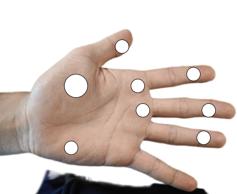

# Force Tracking System - `force_tracking`
Force/Position Tracking Gloves Hardware Design and Firmware Packages for collecting interaction force between human and environment (Note that data acquisition APIs are located in `mo_cap`).

## Force Tracking Glove Hardware Specifications

### 1. Force Sensor Distribution
- A: Total of 8 Force Sensors on each hand. Sensor distribution as detailed below:
    - 2 x Palm Abductor sensor
    - 3 x Metacarpal base sensor (index, middleg)
    - 4 x Finger sensors (thumb, index, middle, ring and little)
    - 
- B: Simplified 6 Force Sensors on each hand. Sensor distribution as detailed below:
    - 2 x Palm Abductor sensor
    - 4 x Finger sensors (thumb, index, middle, ring and little)
    - 
- Reference:
    - [[1]](https://doi.org/10.1080/09638280410001704278) `A comparison of the grip force distribution in natural hands and in prosthetic hands, 2004`
    - [[2]](https://doi.org/10.1016/j.jht.2016.10.009) `Load distribution of the hand during cylinder grip analyzed by Manugraphy, 2017`
    - [[3]](https://doi.org/10.1080/00140139508925140) `Grip Pressure Distribution Under Static and Dynamic Loading, 1993`

### 2. Force Sensor Specifications
- Force Range:
    - Recommendation - 0.1 to 80N in normal direction for entire hand function evaluation
        - [[4]](https://doi.org/10.1109/TBME.1986.325808) `Sensors for Use with Functional Neuromuscular Stimulation, 1986`
    - Common - 0.1 - 30N for each contact
        - [[1]](https://doi.org/10.1080/09638280410001704278) `A comparison of the grip force distribution in natural hands and in prosthetic hands, 2004 - Conductive Polymer Sensor`
        - [[5]](https://doi.org/10.1016/0021-9290(91)90310-J) `A conductive polymer sensor for measuring external finger forces, 1991 -  Conductive Polymer Sensor`
    - Acceptable: 0 - 50N for each contact
- Force Resolution: 
    - Recommendation - 0.1N (low force) - 1N (high force) for hand function evaluation
        - [[4]](https://doi.org/10.1109/TBME.1986.325808) `Sensors for Use with Functional Neuromuscular Stimulation, 1986`
    - Common - 0.3N - 0.33N  
        - [[5]](https://doi.org/10.1016/0021-9290(91)90310-J) `A conductive polymer sensor for measuring external finger forces, 1991 -  Conductive polymer sensor`
        - [[6]](https://doi.org/10.1109/Transducers50396.2021.9495692) `A Glove-Based Human-Machine Interface Assisted by Ultra-Stretchable Strain Sensors and Three-Axis Force Sensors, 2021 - PDMS/MWCNT Peizoresistive sensor`
        - [[7]](https://doi.org/10.1109/IMTC.2000.848849) `A Strain Gauge Tactile Sensor for Finger-Mounted Applications, 2000 - Strain Gauge sensor`
    - Acceptable: < 0.5N
- Desirable to measure shear forces

### 3. Force Tracking Glove CAD file
- To Be Completed

### 4. Glove Localization and Hand Kinematics
- Absolute 3D position and orientation tracking 
    - [HTC VIVE Tracker](https://www.vive.com/au/accessory/tracker3/)
- Relative contact point position
    - [StretchSense Studio Glove](https://stretchsense.com/mocap-studio/)

## Force Tracking Glove Data Acquisition
- Hand Position and Orientation Acquisition
    - refer to `mo_cap/vr` or refer to OpenVR SDK (SteamVR) / OpenSDK (StretchSense)
    - Max Sampling Rate - HTC Vive (tested up to 250 Hz), StretchSense Glvoe (60 Hz)
- Force Acquisition
    - Arduino
    - Max Sampling Rate - ??? Hz

